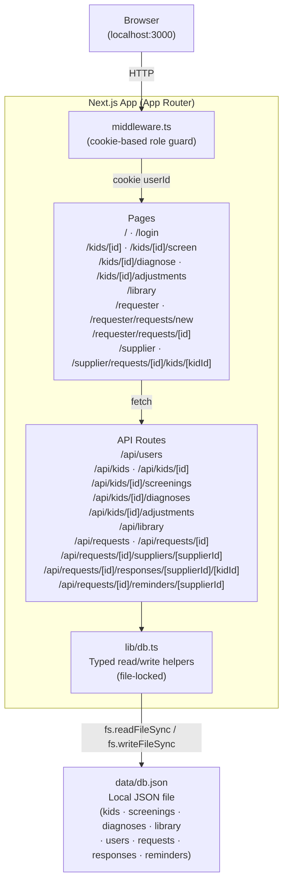
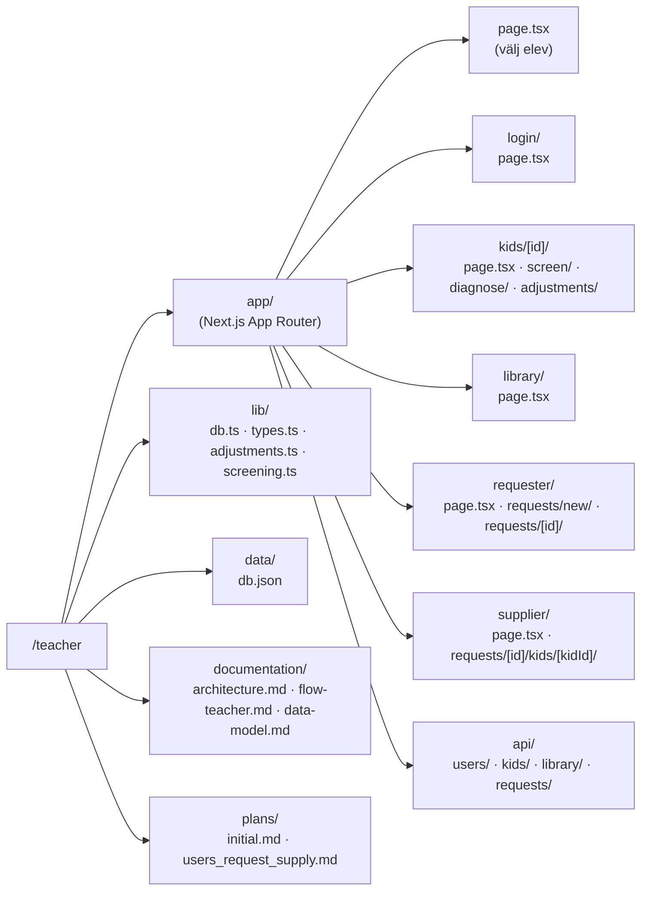

# System Architecture

```mermaid
graph TD
    Browser["Browser\n(localhost:3000)"]

    subgraph NextJS["Next.js App (App Router)"]
        Pages["Pages\n/ · /login\n/kids/[id] · /kids/[id]/screen\n/kids/[id]/diagnose · /kids/[id]/adjustments\n/library\n/requester · /requester/requests/new\n/requester/requests/[id]\n/supplier · /supplier/requests/[id]/kids/[kidId]"]
        APIRoutes["API Routes\n/api/users\n/api/kids · /api/kids/[id]\n/api/kids/[id]/screenings\n/api/kids/[id]/diagnoses\n/api/kids/[id]/adjustments\n/api/library\n/api/requests · /api/requests/[id]\n/api/requests/[id]/suppliers/[supplierId]\n/api/requests/[id]/responses/[supplierId]/[kidId]\n/api/requests/[id]/reminders/[supplierId]"]
        Middleware["middleware.ts\n(cookie-based role guard)"]
        LibDB["lib/db.ts\nTyped read/write helpers\n(file-locked)"]
    end

    DataFile["data/db.json\nLocal JSON file\n(kids · screenings · diagnoses · library\n· users · requests · responses · reminders)"]

    Browser -->|HTTP| Middleware
    Middleware -->|cookie userId| Pages
    Pages -->|fetch| APIRoutes
    APIRoutes --> LibDB
    LibDB -->|fs.readFileSync / fs.writeFileSync| DataFile
```

## Folder Structure

```mermaid
graph LR
    Root["/teacher"]
    Root --> App["app/\n(Next.js App Router)"]
    Root --> Lib["lib/\ndb.ts · types.ts · adjustments.ts · screening.ts"]
    Root --> Data["data/\ndb.json"]
    Root --> Documentation["documentation/\narchitecture.md · flow-teacher.md · data-model.md"]
    Root --> Plans["plans/\ninitial.md · users_request_supply.md"]

    App --> AppRoot["page.tsx\n(välj elev)"]
    App --> AppLogin["login/\npage.tsx"]
    App --> AppKids["kids/[id]/\npage.tsx · screen/ · diagnose/ · adjustments/"]
    App --> AppLibrary["library/\npage.tsx"]
    App --> AppRequester["requester/\npage.tsx · requests/new/ · requests/[id]/"]
    App --> AppSupplier["supplier/\npage.tsx · requests/[id]/kids/[kidId]/"]
    App --> AppAPI["api/\nusers/ · kids/ · library/ · requests/"]
```
