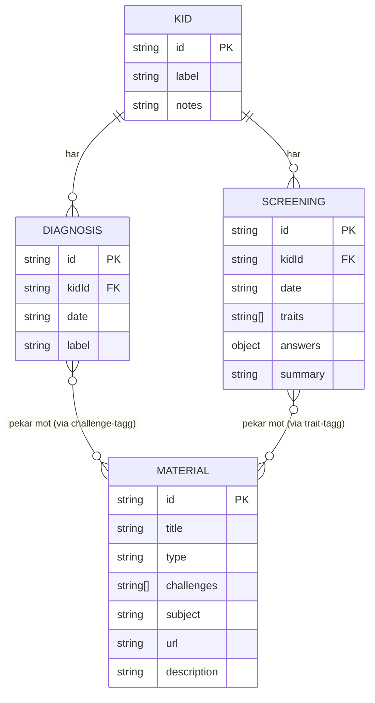
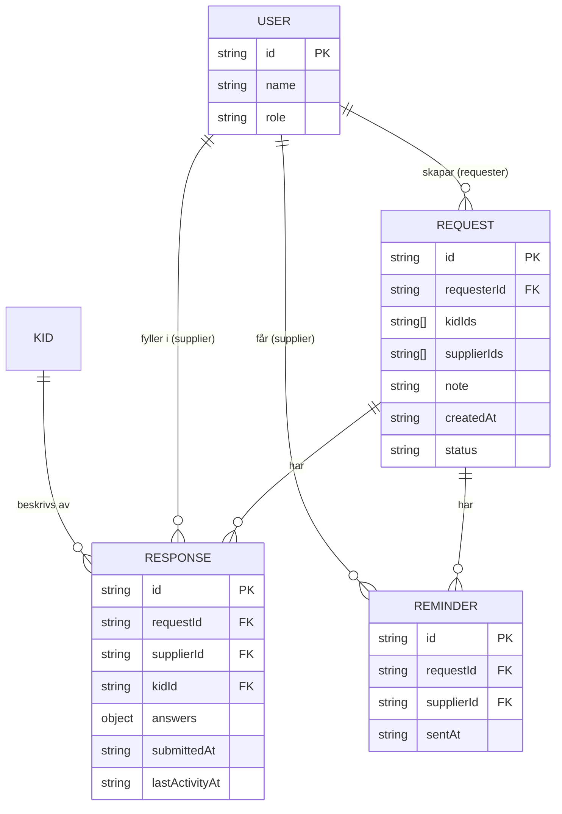
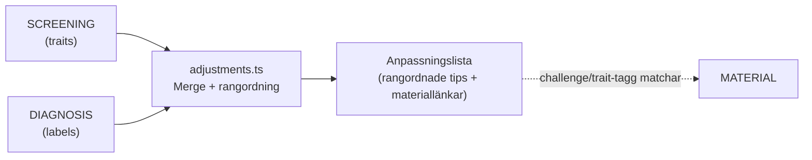

# Datamodell

## Befintliga entiteter

## Nya entiteter — Request & Supply-modulen

## Härledda anpassningar (ej lagrade)

> Anpassningar beräknas vid varje anrop till `GET /api/kids/[id]/adjustments` och
> lagras inte i `db.json`. Det håller datan ren och tips alltid aktuella.
