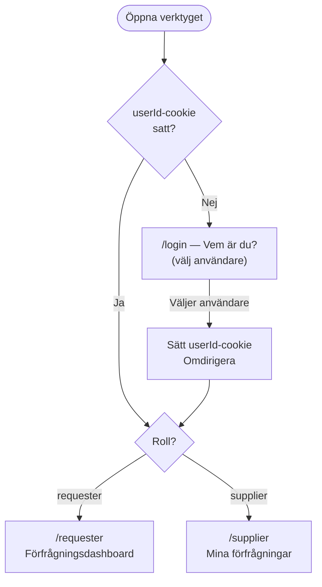
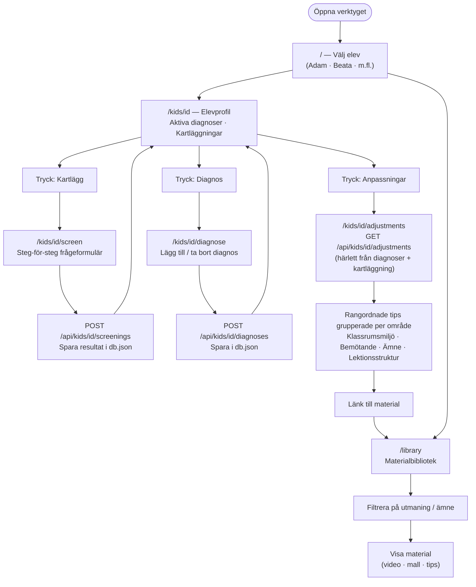
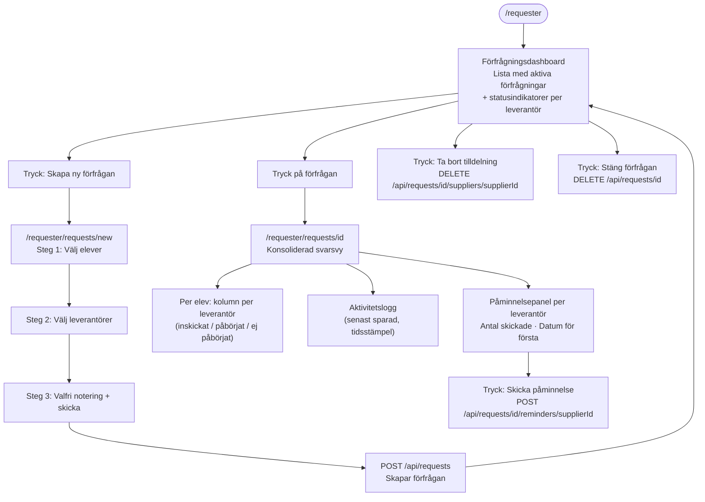
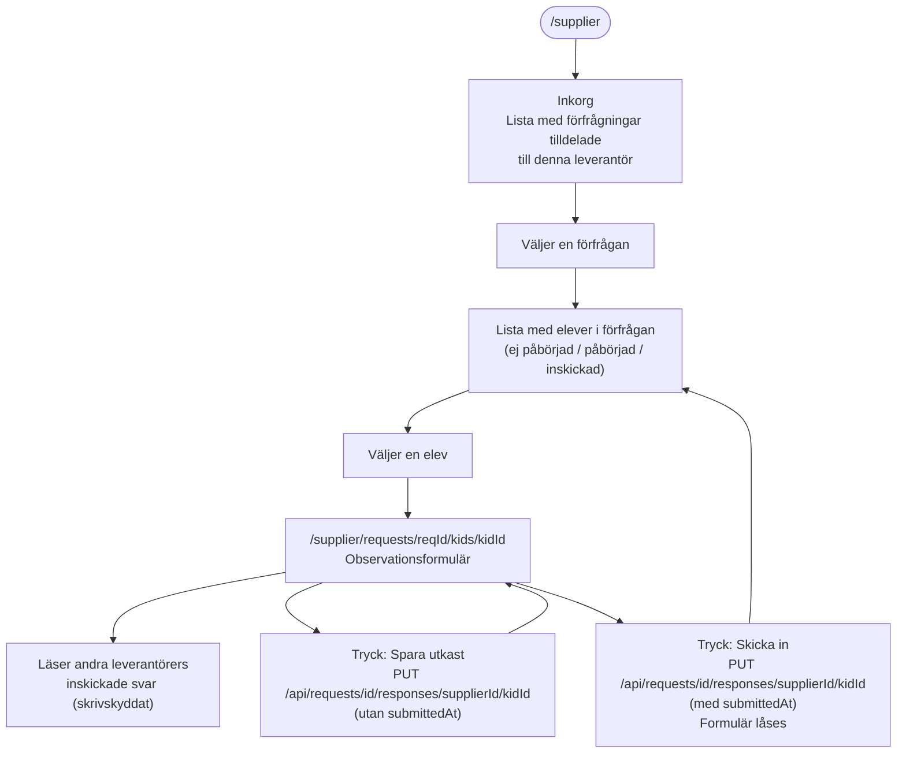

# Användarflöden

## Gemensamt: Inloggning

```mermaid
flowchart TD
    Start([Öppna verktyget]) --> Cookie{userId-cookie\nsatt?}
    Cookie -->|Nej| Login["/login — Vem är du?\n(välj användare)"]
    Cookie -->|Ja| RoleCheck{Roll?}
    Login -->|Väljer användare| SetCookie["Sätt userId-cookie\nOmdirigera"]
    SetCookie --> RoleCheck
    RoleCheck -->|requester| Requester["/requester\nFörfrågningsdashboard"]
    RoleCheck -->|supplier| Supplier["/supplier\nMina förfrågningar"]
```

---

## Lärarens flöde (befintligt)

```mermaid
flowchart TD
    Start([Öppna verktyget]) --> ElevLista["/ — Välj elev\n(Adam · Beata · m.fl.)"]

    ElevLista --> Profil["/kids/id — Elevprofil\nAktiva diagnoser · Kartläggningar"]

    Profil --> KartBtn["Tryck: Kartlägg"]
    Profil --> DiagBtn["Tryck: Diagnos"]
    Profil --> AnjBtn["Tryck: Anpassningar"]

    KartBtn --> Fragor["/kids/id/screen\nSteg-för-steg frågeformulär"]
    Fragor --> SparaKart["POST /api/kids/id/screenings\nSpara resultat i db.json"]
    SparaKart --> Profil

    DiagBtn --> DiagForm["/kids/id/diagnose\nLägg till / ta bort diagnos"]
    DiagForm --> SparaDiag["POST /api/kids/id/diagnoses\nSpara i db.json"]
    SparaDiag --> Profil

    AnjBtn --> Anpassningar["/kids/id/adjustments\nGET /api/kids/id/adjustments\n(härlett från diagnoser + kartläggning)"]
    Anpassningar --> Tips["Rangordnade tips grupperade per område\nKlassrumsmiljö · Bemötande · Ämne · Lektionsstruktur"]
    Tips --> MatLink["Länk till material"]

    MatLink --> Bibliotek["/library\nMaterialbibliotek"]
    Bibliotek --> Filter["Filtrera på utmaning / ämne"]
    Filter --> Material["Visa material\n(video · mall · tips)"]

    ElevLista --> Bibliotek
```

---

## Beställarens flöde (Malin den magnifika)

```mermaid
flowchart TD
    Start([/requester]) --> Dashboard["Förfrågningsdashboard\nLista med aktiva förfrågningar\n+ statusindikatorer per leverantör"]

    Dashboard --> NyBtn["Tryck: Skapa ny förfrågan"]
    NyBtn --> StepKids["/requester/requests/new\nSteg 1: Välj elever"]
    StepKids --> StepSuppliers["Steg 2: Välj leverantörer"]
    StepSuppliers --> StepConfirm["Steg 3: Valfri notering + skicka"]
    StepConfirm --> CreateReq["POST /api/requests\nSkapar förfrågan"]
    CreateReq --> Dashboard

    Dashboard --> DetailBtn["Tryck på förfrågan"]
    DetailBtn --> Detail["/requester/requests/id\nKonsoliderad svarsvy"]
    Detail --> AllAnswers["Per elev: kolumn per leverantör\n(inskickat / påbörjat / ej påbörjat)"]
    Detail --> ActivityLog["Aktivitetslogg\n(senast sparad, tidsstämpel)"]
    Detail --> ReminderPanel["Påminnelsepanel per leverantör\nAntal skickade · Datum för första"]
    ReminderPanel --> SendReminder["Tryck: Skicka påminnelse\nPOST /api/requests/id/reminders/supplierId"]

    Dashboard --> RemoveBtn["Tryck: Ta bort tilldelning\nDELETE /api/requests/id/suppliers/supplierId"]
    Dashboard --> CloseBtn["Tryck: Stäng förfrågan\nDELETE /api/requests/id"]
```

---

## Leverantörens flöde (Anna · Erik · Sara)

```mermaid
flowchart TD
    Start([/supplier]) --> Inbox["Inkorg\nLista med förfrågningar tilldelade\ntill denna leverantör"]

    Inbox --> SelectReq["Väljer en förfrågan"]
    SelectReq --> KidList["Lista med elever i förfrågan\n(ej påbörjad / påbörjad / inskickad)"]

    KidList --> SelectKid["Väljer en elev"]
    SelectKid --> Form["/supplier/requests/reqId/kids/kidId\nObservationsformulär"]

    Form --> OthersPanel["Läser andra leverantörers\ninskickade svar (skrivskyddat)"]
    Form --> SaveDraft["Tryck: Spara utkast\nPUT /api/requests/id/responses/supplierId/kidId\n(utan submittedAt)"]
    SaveDraft --> Form

    Form --> Submit["Tryck: Skicka in\nPUT /api/requests/id/responses/supplierId/kidId\n(med submittedAt)\nFormulär låses"]
    Submit --> KidList
```
